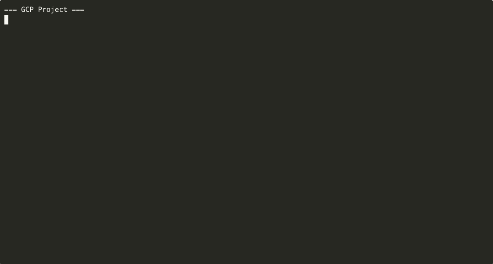

# Aura — Google SDE Interview Coach

Aura is a real-time AI-powered Google SDE interview coach built on the **Google ADK** + **Gemini Live** native audio stack with **LiveKit** WebRTC transport and **Vertex AI** persistent session memory.

This repo is now in a hackathon-ready state: the core demo flow is implemented, locally testable, deploys on Google Cloud Run, and includes the final spoken scoring and memory continuity features that matter in a live judging session.

## Core Features

1. Real-time voice interview agent with interruption handling and Gemini server-side VAD.
2. Four-round Google-style interview flow covering behavioural, coding, system design, and debrief.
3. Live spoken per-round scoring on a clear 1-4 scale, plus post-call rubric grading, answer feedback, and exportable session summary.
4. Candidate progress view for named users, showing recent sessions, average rubric score, and question volume.
5. Named-user interview state persistence across restarts, carrying forward asked questions, rubric grades, and answer notes.
6. Self-healing Vertex AI session-service recovery for repeated session persistence failures.
7. Google Cloud deployment on Cloud Run with Artifact Registry, Secret Manager, Vertex AI, Terraform, and Cloud Build CI/CD.

## Demo Value

Why this is a strong live demo:
1. It is visibly multimodal: the candidate speaks naturally, Aura responds with low-latency voice, and the UI shows live transcript and session state.
2. It demonstrates real continuity: named users come back to preserved notes, grades, and prior round context instead of starting from zero.
3. It closes the feedback loop during the session: Aura can now speak a clear round score out of 4 before wrap-up, instead of hiding evaluation until the end.
4. It is actually deployable: the same repo includes Cloud Run, Cloud Build, Artifact Registry, Secret Manager, and Terraform infrastructure.

| Layer | Technology |
|---|---|
| Agent framework | Google ADK (`google-adk`) — `LlmAgent`, `VertexAiSessionService` |
| Voice model | `gemini-live-2.5-flash-native-audio` via Vertex AI bidi stream |
| WebRTC transport | LiveKit (`livekit`, `livekit-api`) |
| Session memory | Vertex AI Agent Engine (`VertexAiSessionService`) with named-user state snapshots plus automatic recovery after repeated session-service failures |
| Infra | Google Cloud only (Cloud Run, Artifact Registry, Secret Manager, Vertex AI) |
| Backend | FastAPI + Python 3.11, containerised on Cloud Run |
| Frontend | Vite + React + LiveKit JS SDK |
| IaC | Terraform + Cloud Build CI/CD |

---

## Architecture


<details>
<summary>ASCII overview</summary>

```
Browser mic → LiveKit WebRTC → PCM16 @ 16 kHz
                                    ↓
           Silero VAD (UI-only hints)     ← bot/audio/silero_vad.py
                                    ↓
                         Gemini Live (Vertex AI)      ← server-side VAD
                         gemini-live-2.5-flash-native-audio
                                    ↓
Browser speaker ← LiveKit WebRTC ← PCM16 @ 24 kHz ← Gemini audio response
```

</details>

### VAD strategy — Gemini server-side turn detection + local UI hints

Aura uses **Gemini's built-in server-side VAD** for actual turn detection and interruption semantics. A lightweight local **Silero VAD** is still used only for fast UI speaking indicators and STS timing, not for deciding when Gemini should end a turn. SmartTurn and RNNoise are not part of the active runtime path.

Server VAD is configured via `RealtimeInputConfig` → `AutomaticActivityDetection`:

| Parameter | Value | Effect |
|---|---|---|
| `silence_duration_ms` | `600` | 600 ms of silence ends a turn — balanced: fast response without premature cuts |
| `prefix_padding_ms` | `200` | Includes 200 ms of audio before speech start — captures leading consonants |

### Latency analysis

| Approach | End-of-speech → first audio byte | Notes |
|---|---|---|
| **Server VAD (current)** | **~150–300 ms** | VAD runs inside Gemini's inference pipeline; no round-trip penalty |
| Client Silero + SmartTurn turn control (removed) | ~900–1 400 ms | Too much local buffering + re-arm latency for primary turn detection |
| Pure silence threshold (no VAD) | ~300–500 ms | Simple but clips fast speakers; misses barge-in |

**Server VAD wins on latency** because:
- VAD judgment happens inside the same process as the LLM — no extra network hop
- Barge-in (interruption) is handled natively without any muting gate on the send path
- `silence_duration_ms=800` is the only mandatory wait; the 150 ms figure applies when the model starts generating immediately after speech ends

Full diagram and design decisions: see [Architecture](#architecture) section above.

---

## Local Development

### Prerequisites

- Python 3.11+, [`uv`](https://github.com/astral-sh/uv)
- Node.js 20+
- A [LiveKit Cloud](https://livekit.io) project (free tier works)
- A Google Cloud project with Vertex AI enabled **or** a Google AI Studio API key

### 1. Clone and install

```bash
git clone https://github.com/srthorat/aura-sde-interview-agent.git
cd aura-sde-interview-agent
cp .env.example .env
# Fill in .env — see section below
uv sync
```

### 2. Configure `.env`

Minimum required values:

```bash
# LiveKit
LIVEKIT_URL=wss://your-project.livekit.cloud
LIVEKIT_API_KEY=your_livekit_api_key
LIVEKIT_API_SECRET=your_livekit_api_secret

# Google Cloud (Vertex AI path — recommended)
GOOGLE_CLOUD_PROJECT_ID=your-gcp-project-id
GOOGLE_CLOUD_LOCATION=us-central1
# Authenticate with: gcloud auth application-default login

# --- OR --- Google AI Studio (preview path, no GCP project needed)
# GEMINI_MODEL=preview
# GOOGLE_API_KEY=your_ai_studio_api_key
```

### 3. Run the backend

```bash
# Optional: use a non-default port for local work
# export PORT=7863

uv run python -m bot.bot
# Listening on http://localhost:${PORT:-7862}
```

### 4. Run the frontend (separate terminal)

```bash
cd frontend
nvm use   # picks Node 20 from .nvmrc automatically
npm install
npm run dev
# http://localhost:3000
```

Open `http://localhost:3000`, enter a User ID (1–10), click **Connect**, and speak.

### 5. Build the frontend for the backend-served app

The FastAPI app serves static files from `frontend/dist`. For the integrated app on the backend port, build the frontend first:

```bash
cd frontend
nvm use
npm install
npm run build
```

Then run the backend and open `http://localhost:${PORT:-7862}`.

### 6. Single-container run (Docker)

```bash
cp .env.example .env   # fill in values

# Optional local override
# echo 'PORT=7863' >> .env

docker compose up --build -d
docker compose ps
curl http://localhost:${PORT:-7862}/health
```

Open `http://localhost:${PORT:-7862}`.

### Local setup used in this repo right now

If you want the same flow we are using during development:

```bash
cp .env.example .env

# Edit .env and set your real LiveKit / Google values.
# If you want the backend on 7863 instead of 7862:
# PORT=7863

cd frontend
nvm use
npm install
npm run build

cd ..
uv sync
uv run python -m bot.bot
```

Open `http://localhost:7863` if `PORT=7863`, otherwise `http://localhost:7862`.

---

## Session Persistence

Aura remembers each candidate's interview history (questions asked, scores, round progress) across reconnects. There are three tiers — use the one that fits your deployment:

| Tier | Env var | Survives | Best for |
|---|---|---|---|
| **Vertex AI Agent Engine** | `VERTEX_AI_REASONING_ENGINE_ID` | Container restarts, Cloud Run scale-out, server replacement | Production / Cloud Run |
| **File-based** | `SESSION_PERSIST_DIR` | Process restarts (with Docker volume mount) | Single-VM / local dev |
| **In-memory** | _(neither set)_ | Current process only | Quick testing |

---

### Tier 1 — Vertex AI Agent Engine (recommended for Cloud Run)

This uses Google-managed storage so sessions survive any restart, upgrade, or scale event.

#### Step 1 — Enable the API

```bash
gcloud services enable aiplatform.googleapis.com \
  --project=YOUR_PROJECT_ID
```

#### Step 2 — Create the Reasoning Engine resource

The Reasoning Engine is just a named container for sessions — no code is deployed to it.

```bash
gcloud ai reasoning-engines create \
  --display-name="aura-sessions" \
  --region=us-central1 \
  --project=YOUR_PROJECT_ID
```

The output will look like:
```
Created reasoning engine: projects/YOUR_PROJECT_ID/locations/us-central1/reasoningEngines/1234567890123456789
```

Note the **numeric ID** at the end (e.g. `1234567890123456789`).

#### Step 3 — Grant the service account access

The identity running the bot needs `aiplatform.user` on the project:

```bash
# For local dev — your personal account
gcloud projects add-iam-policy-binding YOUR_PROJECT_ID \
  --member="user:YOUR_EMAIL" \
  --role="roles/aiplatform.user"

# For Cloud Run — the Cloud Run service account
gcloud projects add-iam-policy-binding YOUR_PROJECT_ID \
  --member="serviceAccount:YOUR_SA@YOUR_PROJECT_ID.iam.gserviceaccount.com" \
  --role="roles/aiplatform.user"
```

#### Step 4 — Set the env var

In `.env` (local) or Cloud Run environment:

```bash
VERTEX_AI_REASONING_ENGINE_ID=1234567890123456789
```

Comment out or remove `SESSION_PERSIST_DIR` — when `VERTEX_AI_REASONING_ENGINE_ID` is set it takes priority.

#### Step 5 — Restart and verify

```bash
# Local
uv run python -m bot.bot
# Logs should show:
# [adk] Using VertexAiSessionService (engine: 1234567890123456789)

# Docker
docker compose up -d
docker compose logs | grep "VertexAi\|session"
```

---

### Tier 2 — File-based persistence (single VM / local dev)

Sessions are written as JSON files to a local directory. Works without any GCP setup.

Add to `.env`:
```bash
SESSION_PERSIST_DIR=/data/aura-sessions
```

For Docker, mount a host volume so data survives container replacement:

```yaml
# docker-compose.yml volumes section:
volumes:
  - /data/aura-sessions:/data/aura-sessions
```

Logs will show:
```
[adk] Using FileSessionService — sessions persist to /data/aura-sessions
```

---

## Cloud Deployment (Google Cloud Run)

### One-click deploy

```bash
cd infra
cp terraform.tfvars.example terraform.tfvars   # fill in project_id, livekit_url, etc.
./deploy.sh
```

The script:
1. Stores LiveKit credentials in Secret Manager
2. Provisions Cloud Run, Artifact Registry, IAM, and Cloud Build trigger via Terraform
3. Builds and pushes the Docker image to Artifact Registry
4. Deploys to Cloud Run and prints the live URL

### Manual Terraform

```bash
cd infra
cp terraform.tfvars.example terraform.tfvars   # edit values

terraform init
terraform plan
terraform apply
```

### CI/CD

`cloudbuild.yaml` at the repo root is triggered automatically on every push to `main`. It:
1. Builds the Docker image (with layer caching from the `:latest` tag)
2. Pushes `:<commit-sha>` and `:latest` to Artifact Registry
3. Rolls out the new image to Cloud Run

The trigger is now configured and managed through Terraform in [infra/main.tf](infra/main.tf), using the `aura-deploy` service account.

#### Live Deployment Proof



For the full operational runbook, see [docs/OPERATION_MANAGE.md](docs/OPERATION_MANAGE.md).

### Hackathon Requirement Check

What is already covered in this repo:
1. Real-time multimodal agent: Aura uses live voice input and live voice/text output with interruption handling.
2. Mandatory Google AI stack: the project uses both Google ADK and Gemini Live on Vertex AI.
3. Google Cloud hosting: the backend is deployed on Cloud Run and uses Artifact Registry, Secret Manager, Cloud Build, and Vertex AI.
4. Reproducibility: local spin-up and cloud deployment instructions are included in this README and [docs/OPERATION_MANAGE.md](docs/OPERATION_MANAGE.md).
5. Architecture documentation: see the Architecture section here and [docs/Aura_Design_Doc.md](docs/Aura_Design_Doc.md).

What still needs to be prepared for submission:
1. A short demo video under 4 minutes.

Already completed:
- GCP deployment proof: embedded as animated GIF in the [CI/CD](#cicd) section above, showing Cloud Build SUCCESS + Artifact Registry image tagged with the commit SHA + Cloud Run Ready: True.
- Architecture diagram: embedded in the [Architecture](#architecture) section.
- Submission text: [docs/SUBMISSION_DRAFT.md](docs/SUBMISSION_DRAFT.md).

For the final implementation architecture, see [docs/Aura_Design_Doc.md](docs/Aura_Design_Doc.md).

---

## Environment Variables

See [`.env.example`](.env.example) for the full list with descriptions. Key variables:

| Variable | Required | Description |
|---|---|---|
| `LIVEKIT_URL` | ✓ | LiveKit server WebSocket URL |
| `LIVEKIT_API_KEY` | ✓ | LiveKit API key |
| `LIVEKIT_API_SECRET` | ✓ | LiveKit API secret |
| `GOOGLE_CLOUD_PROJECT_ID` | ✓* | GCP project for Vertex AI |
| `GOOGLE_CLOUD_LOCATION` | — | GCP region (default: `us-central1`) |
| `VERTEX_AI_REASONING_ENGINE_ID` | — | Numeric ID of Vertex AI Reasoning Engine for cross-deployment session persistence (see [Session Persistence](#session-persistence)) |
| `SESSION_PERSIST_DIR` | — | Local directory path for file-based session persistence (fallback when Reasoning Engine ID is not set) |
| `GOOGLE_API_KEY` | ✓* | Google AI Studio key (preview path only) |
| `GEMINI_LIVE_MODEL` | — | Model name (default: `gemini-live-2.5-flash-native-audio`) |
| `GEMINI_TEXT_MODEL` | — | Text-only grading/summary model (default: `gemini-2.5-flash`) |
| `GEMINI_VOICE` | — | Voice name (default: `Aoede`) |
| `USER_IDLE_TIMEOUT_SECS` | — | Idle silence timeout (default: `120`) |
| `MAX_CALL_DURATION_SECS` | — | Hard call limit in seconds (default: `840`) |

\* One of `GOOGLE_CLOUD_PROJECT_ID` (Vertex AI) or `GOOGLE_API_KEY` (preview) is required.

---

## Project Structure

```
├── bot/
│   ├── agent.py              # ADK LlmAgent, tool registry, LIVE_TOOL_DECLARATIONS
│   ├── bot.py                # FastAPI app — /livekit/session, /health
│   ├── audio/
│   │   ├── silero_vad.py     # Local UI-only speaking detector
│   │   ├── silero_vad.onnx   # Bundled Silero model artifact required at runtime
│   │   └── smart_turn.py     # Deprecated placeholder kept for historical context
│   ├── pipelines/
│   │   └── voice.py          # AuraVoiceSession — LiveKit ↔ Gemini Live bridge
│   ├── processors/
│   │   └── session_timer.py  # Call duration utility
│   └── prompts/
│       ├── grading_rubric.md             # Rubric used by post-call grading
│       ├── system_prompt.md              # Base persona (fallback)
│       ├── system_prompt_anon.md         # Anonymous user variant
│       ├── system_prompt_named_fast.md   # Named user — fast-start variant
│       ├── prompt_greeting_anon.md       # Opening greeting for anon users
│       ├── prompt_greeting_named.md      # Opening greeting for named users
│       └── prompt_round_*.md             # Per-round instruction overlays (8 files)
├── frontend/
│   ├── public/demo.html      # Voice UI (real-time transcript, metrics, summary, progress)
│   └── src/App.tsx           # Vite/React wrapper
├── infra/
│   ├── main.tf               # Cloud Run, Artifact Registry, IAM, Secret Manager
│   ├── variables.tf / outputs.tf / versions.tf
│   ├── terraform.tfvars.example
│   └── deploy.sh             # One-click bootstrap script
├── cloudbuild.yaml           # Cloud Build CI/CD pipeline
├── Dockerfile                # Multi-stage: Node.js build + Python 3.11 slim
├── docker-compose.yml        # Local single-container run
├── pyproject.toml            # Python dependencies (uv)
└── .env.example              # All environment variables documented
```

---

## Tech Stack — Components, Roles & Why We Chose Them

### LiveKit — WebRTC Transport Layer

**What it does:** LiveKit is a self-hostable WebRTC SFU (Selective Forwarding Unit) that manages real-time audio/video rooms. In Aura it provides the bi-directional audio channel between the browser microphone and the Cloud Run backend, plus a server-side data channel for structured events (transcript, grades, call summary).

**Why LiveKit over raw WebRTC or other transports:**

| Concern | Raw WebRTC | LiveKit |
|---|---|---|
| NAT traversal / TURN | Manual STUN/TURN setup | Built-in, fully managed |
| Server-side audio access | Impossible without media server | `rtc.AudioStream` gives PCM frames directly in Python |
| Participant signalling | Custom protocol required | SDK handles join/leave/reconnect |
| Data channel | Unreliable ordering without SCTP work | `room.local_participant.publish_data()` — reliable ordered delivery |
| Scalability | Point-to-point only | SFU routes audio; scales to many participants |
| Python SDK | None official | `livekit` + `livekit-api` packages — first-class async support |

**Key integration points in Aura:**
- `rtc.AudioStream(track)` — pulls incoming browser mic PCM16 @ 16 kHz frame-by-frame
- `rtc.AudioSource(GEMINI_OUTPUT_SAMPLE_RATE, GEMINI_OUTPUT_CHANNELS)` — pushes Gemini audio output back to browser
- `room.local_participant.publish_data(payload, reliable=True)` — sends transcript lines, grade chips, and call summary JSON to the UI without a separate WebSocket
- `rtc.RoomEvent` — drives session lifecycle (participant join/leave triggers session start/teardown)
- `livekit-api` + `api.AccessToken` — backend mints short-lived JWT tokens per session; no credentials exposed to browser

---

### Google ADK (`google-adk`) — Agent Orchestration

**What it does:** ADK (`LlmAgent`, `Runner`, `VertexAiSessionService`) wraps the Gemini Live bidi stream, handles tool dispatch, and manages session lifecycle. It eliminates writing a custom WebSocket loop for Gemini's `BidiGenerateContent` RPC.

**Why ADK:**
- Tool calls from Gemini Live are dispatched to Python functions automatically — no `if tool_name == "..."` switching
- `VertexAiSessionService` persists the full conversation event history to Vertex AI Agent Engine natively
- `RunConfig` gives a clean surface for configuring VAD, speech, modalities, and session resumption in one place
- `LiveRequestQueue` decouples audio ingestion from the ADK event loop — audio can be enqueued from the LiveKit receive loop without blocking

---

### Gemini Live (`gemini-live-2.5-flash-native-audio`) — Voice Brain

**What it does:** Native audio model that speaks, listens, detects turn ends, handles barge-in, and evaluates interview answers — all in one bidi stream.

**Why native audio (not text-to-speech + text):**
- Single round-trip: audio in → audio out in the same inference pass, no TTS post-step
- Server-side VAD: turn detection runs inside the model pipeline, eliminating client-side buffering latency
- `enable_affective_dialog=True`: Gemini modulates tone and pacing based on conversational context
- STS latency 126–300 ms on conversational turns vs. 900–1400 ms with client Silero + SmartTurn

---

### Silero VAD (`silero_vad.onnx` + `onnxruntime`) — Local UI Hints

**What it does:** A lightweight ONNX speech detection model that runs locally in-process on each 32 ms audio frame (512 samples @ 16 kHz).

**Why a separate local VAD in addition to Gemini's server-side VAD:**
- Server VAD fires after Gemini processes the audio — there is a ~80–150 ms delay before the UI knows the user is speaking
- Silero fires immediately on the local audio frame, enabling instant "user speaking" UI indicators and barge-in queue clear without waiting for a Gemini event
- ONNX runtime is single-threaded, CPU-only, < 5 MB — no GPU, no network, negligible latency

---

### FastAPI + Uvicorn — Backend HTTP/WebSocket Server

**What it does:** Serves three surfaces:
1. `POST /livekit/session` — mints LiveKit tokens, spawns the voice session task
2. `GET /health` — Cloud Run health check
3. Static file serving — `frontend/dist/` (built React app)

**Why FastAPI:**
- `async def` handlers integrate with the `asyncio` event loop used by LiveKit and ADK — no thread-pool overhead
- Pydantic request/response models give automatic input validation and OpenAPI docs
- Lifespan context manager handles pre-warm tasks cleanly at startup

---

### Vertex AI Agent Engine — Session Persistence

**What it does:** Google-managed cloud storage for ADK session events. Each named candidate's history (questions asked, rubric grades, answer notes, round number) is persisted as ADK `Event` objects and survives container restarts, Cloud Run scale-out, and re-deployments.

**Why Vertex AI Agent Engine over a database:**
- Native ADK integration — `VertexAiSessionService` is a drop-in for `InMemorySessionService`
- No schema migrations, no connection pool, no DB maintenance
- Events are JSON-serialisable and readable without a custom SDK
- Automatic IAM-gated access — no credential rotation needed

---

### Terraform + Cloud Build — Infrastructure as Code + CI/CD

**What it does:** All GCP resources (Cloud Run service, Artifact Registry repo, Secret Manager secrets, IAM bindings, Cloud Build trigger, Vertex AI Reasoning Engine) are declared in `infra/main.tf`. Any push to `main` triggers `cloudbuild.yaml`: build → tag with commit SHA → push to Artifact Registry → roll out to Cloud Run.

**Why Terraform over console clicks:**
- Reproducible: `terraform apply` from a fresh project recreates the full stack in ~3 minutes
- Auditable: every infra change is a Git commit
- Cloud Build trigger is itself managed by Terraform — no manual console setup

---

## Adding Tools

Tools are defined in `bot/agent.py`. To add a new tool:

1. Write a Python function and add it to `TOOL_REGISTRY`
2. Add a matching entry to `LIVE_TOOL_DECLARATIONS` (used by the Gemini Live session)
3. Add the function to the `tools=[]` list in `build_adk_agent()`

The same function is invoked whether the call comes from the ADK text runner or the live audio session.

---

## HTTPS Deployment Options

Browser microphone access requires HTTPS on any public URL. Two GCP paths:

### Option A — Cloud Run (recommended, HTTPS built-in)

Cloud Run is already provisioned by Terraform (`infra/`). Google's load balancer terminates TLS automatically — **no Caddy or reverse proxy needed**.

```bash
# One-command deploy (provisions + builds + deploys)
cd infra && ./deploy.sh
```

Your service is immediately available at `https://aura-voice-agent-<hash>-uc.a.run.app`.

---

### Option B — Google Compute Engine VM + Caddy

Use this if you need a persistent VM (e.g. for testing, or if Cloud Run's request-based scaling doesn't fit your workload).

#### 1. Create a GCE VM

```bash
gcloud compute instances create aura-vm \
  --project=YOUR_PROJECT_ID \
  --zone=us-central1-a \
  --machine-type=e2-standard-2 \
  --image-family=debian-12 \
  --image-project=debian-cloud \
  --tags=http-server,https-server \
  --metadata=startup-script='#! /bin/bash
    apt-get update
    apt-get install -y docker.io
    systemctl enable --now docker'
```

#### 2. Open firewall ports

```bash
gcloud compute firewall-rules create allow-http-https \
  --allow=tcp:80,tcp:443 \
  --target-tags=http-server,https-server \
  --project=YOUR_PROJECT_ID
```

#### 3. SSH in and start the container

```bash
gcloud compute ssh aura-vm --zone=us-central1-a

# On the VM:
git clone https://github.com/your-org/aura-sde-interview-agent.git
cd aura-sde-interview-agent
cp .env.example .env   # fill in values

# Optional: if you want Aura on 7863 behind Caddy instead of the default 7862
# echo 'PORT=7863' >> .env

docker compose up --build -d
curl http://127.0.0.1:${PORT:-7862}/health   # verify
```

#### 4. Install Caddy and configure HTTPS

```bash
# On the VM:
apt-get install -y caddy
cp deploy/caddy/Caddyfile.example /etc/caddy/Caddyfile
# Edit /etc/caddy/Caddyfile:
# - replace aura.example.com with your real domain
# - if PORT is not 7862, also change 127.0.0.1:7862 to your chosen port
systemctl enable --now caddy
```

5. **Point DNS** — create an `A` record for your domain pointing to the VM's external IP:
   ```bash
   gcloud compute instances describe aura-vm --zone=us-central1-a \
     --format='value(networkInterfaces[0].accessConfigs[0].natIP)'
   ```

Key points:
- VM deployment is Docker plus Caddy: Docker runs the Aura container, Caddy terminates TLS on `443` and proxies to the local Aura port
- Aura listens on port `7862` by default; if you set `PORT=7863`, update both `docker compose` and the Caddy upstream to `127.0.0.1:7863`
- The Caddyfile includes a `keepalive` transport directive to keep LiveKit WebSocket signalling alive
- Caddy auto-renews Let's Encrypt certificates — no manual cert management needed

---

## Health Check

```bash
curl https://your-cloud-run-url/health
# {"status":"ok","bot":"Aura","transport":"livekit","model":"gemini-live-2.5-flash-native-audio","active_rooms":0}
```
