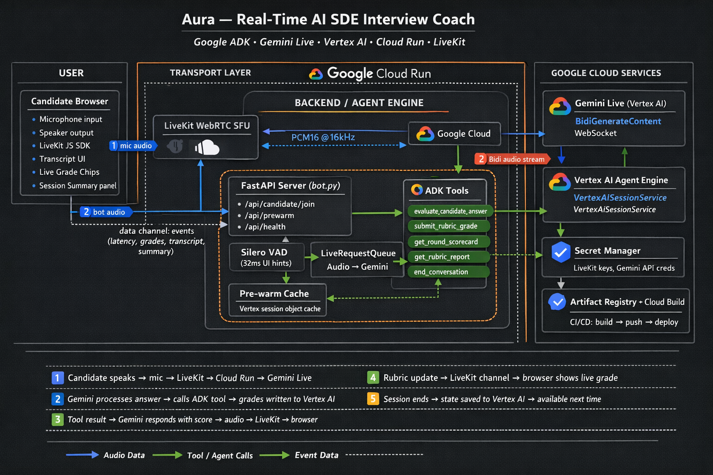

# Submission — Aura: Real-Time AI Google SDE Interview Coach

## Short Description

Aura is a real-time voice-first AI agent that coaches software engineers through a full Google SDE interview loop. Built on Google ADK and Gemini Live native audio, it conducts live spoken mock interviews across Behavioural, Coding, System Design, Debugging, and Targeted Debrief rounds — interrupts gracefully, grades answers on a rubric, delivers spoken per-round scores, and remembers every candidate across sessions using Vertex AI persistent memory.

---

## What It Does

1. **Live voice interview** — Candidate speaks naturally; Aura listens, evaluates, asks follow-ups, and responds in real-time audio. No typing. No turn buttons. No wait states.
2. **Interruption handling** — The candidate can barge in, say "stop", or restart mid-answer. Aura detects it instantly via Gemini server-side VAD + Silero UI hints and adapts without losing context.
3. **Full Google loop** — Two tracks: a 4-round compressed demo and a 6-round advanced Google-style loop (Googliness → Coding 1 → Coding 2 → System Design → Debugging → Targeted Debrief).
4. **Live rubric grading** — Aura calls `evaluate_candidate_answer` after every answer, grades across 8 categories (problem_solving, communication, coding_quality, etc.) and the frontend shows live grade chips during the session.
5. **Spoken per-round scoring** — At round wrap-up, Aura calls `get_round_scorecard()` and delivers a spoken "3 out of 4" style verdict with specific strength and improvement feedback.
6. **Session memory** — Named candidates accumulate grades, notes, and asked questions across sessions. Vertex AI Agent Engine persists state; it is restored on reconnect even after container restart.
7. **Post-call summary** — A structured call summary (rubric grades, narrative, session delta, prior session comparison) is sent to the frontend via LiveKit data channel.

---

## Google Technologies Used

| Technology | Role |
|---|---|
| **Gemini Live** (`gemini-live-2.5-flash-native-audio`) | Native audio model — speaks, listens, detects turn ends, handles barge-in server-side |
| **Google ADK** (`LlmAgent`, `Runner`, `VertexAiSessionService`) | Agent orchestration, tool dispatch, session lifecycle |
| **Vertex AI Agent Engine** | Persistent session storage for named candidates across restarts |
| **Cloud Run** | Backend hosting — containerised FastAPI + Python 3.11 |
| **Cloud Build + Artifact Registry** | CI/CD pipeline: build → push → deploy on every commit |
| **Secret Manager** | Runtime credential injection (LiveKit keys, API credentials) |
| **Terraform** | Infrastructure as code — all GCP resources declared and version-controlled |

---

## How It Breaks the "Text Box" Paradigm

Aura is fully voice-in, voice-out with zero text interaction required:

- **Sees the conversation in context** — Gemini Live maintains a live bidi audio stream. There is no request-response cycle; the model is continuously aware.
- **Hears and speaks** — Native audio model; Aura's voice has a consistent persona (Aoede voice, warm interviewer tone) with affective dialog enabled.
- **Interruption-first design** — Silero VAD fires instant "user started speaking" UI hints; Gemini's server-side `interrupted` event gates bot audio; the audio source queue is cleared within milliseconds. This is the same architecture as Pipecat's barge-in but without the frame pipeline overhead.
- **Context-aware scoring** — Aura does not just acknowledge answers. It evaluates them in real-time, calls structured tools, and delivers a spoken verdict mid-conversation that factors in prior session performance.
- **Live UI feedback** — While the voice conversation plays out, the browser UI simultaneously updates with live grade chips, transcript, and latency metrics — all via LiveKit data channel events.

---

## Agent Architecture



```
Browser mic
    │  WebRTC (LiveKit)
    ▼
FastAPI / LiveKit room bot (Cloud Run)
    │
    ├── Silero VAD ──────────────────► UI events (user-started/stopped-speaking)
    │                                  [barge-in queue clear]
    │
    └── Google ADK Runner
            │  BidiGenerateContent stream
            ▼
        Gemini Live (Vertex AI)
            │  Native audio output + tool calls
            ▼
        ADK Tool dispatcher
            ├── evaluate_candidate_answer  → grades 8 rubric categories + records note
            ├── submit_rubric_grade        → updates individual category
            ├── get_round_scorecard        → computes spoken X-out-of-4 score
            ├── get_rubric_report          → full category breakdown
            ├── get_session_summary        → prior history recap
            └── end_conversation           → teardown + call summary
                    │
                    ▼
            Vertex AI Agent Engine  ◄── Named candidate state (grades, notes, questions)
            (VertexAiSessionService)     persisted across sessions + container restarts

    Audio output path:
    Gemini Live audio frames ─► LiveKit AudioSource ─► WebRTC ─► Browser speaker
```

---

## External Services

- **LiveKit** — WebRTC SFU for audio transport between browser and Cloud Run backend.
- Interview questions are embedded in the application. No external data sources, training data, or proprietary datasets required.

---

## Key Learnings

1. **ADK + Gemini Live is the right stack** — ADK handles tool dispatch automatically; Gemini Live handles VAD and interruption natively. The combination avoids reimplementing both.
2. **Structured state beats raw transcript** — Saving `{grades, asked, notes}` snapshots to Vertex events gives the agent continuity without feeding it the full prior transcript on every reconnect.
3. **Server-side VAD wins on latency** — Running VAD inside the Gemini inference pipeline eliminates the network round-trip. STS latency of 126–800ms on conversational turns vs. 900–1400ms with client-side VAD.
4. **Pre-warm + early kickoff** — Sending the Gemini kickoff prompt before `room.connect()` completes (when the Vertex session is pre-warmed) reduced TTFA from 7.3s to ~5s by overlapping Gemini generation with LiveKit handshake.
5. **Feedback timing is UX** — Delivering a spoken "3 out of 4" score mid-conversation is more valuable for a demo than backend infrastructure refinements.

---

## Innovation & Multimodal UX

- **Breaks the text box** — Zero text input required. The full interview is conducted by voice.
- **Seamless persona** — Consistent Aura identity with an interviewer-coded voice, no filler phrases, no lag-induced pauses.
- **Live-aware** — Aura tracks what's been asked, interrupts gracefully, adjusts difficulty on request, and references prior session context.
- **Two-way real-time data** — Audio flows to Gemini; structured grading events flow back to the UI simultaneously on a separate LiveKit data channel. The experience is genuinely parallel, not sequential.

---

## Technical Robustness

- **Error-resilient** — Vertex AI session failures fall back to InMemory; malformed tool arguments trigger graceful retry prompts; container restart recovery scans up to 10 prior sessions for state.
- **No hallucination on facts** — Questions are pre-loaded into the system prompt from a curated bank. Gemini generates questions only when the bank is exhausted or the wrong round type is requested.
- **Grounding** — Rubric grading uses a fixed 5-point scale (`strong_no → strong_yes`) with category definitions in the prompt; scores are computed deterministically in Python, not inferred by the model.
- **48 tests** — Full pytest suite covering agent tools, bot prompt assembly, VAD, session state, and voice helpers.
- **IaC** — All GCP infrastructure (Cloud Run, Artifact Registry, Secret Manager, Vertex AI, Cloud Build triggers) defined in Terraform.

---

## Ultra-Short Version (for submission form)

Aura is a real-time voice AI agent that runs a full Google SDE mock interview loop — Behavioural, Coding, System Design, Debugging, and Debrief — entirely by voice. Built with Google ADK and Gemini Live native audio on Vertex AI, hosted on Cloud Run. It interrupts gracefully, grades answers live on screen, delivers spoken per-round scores, and remembers named candidates across sessions using Vertex AI persistent memory. No text box. No turn buttons. Just an interview.
